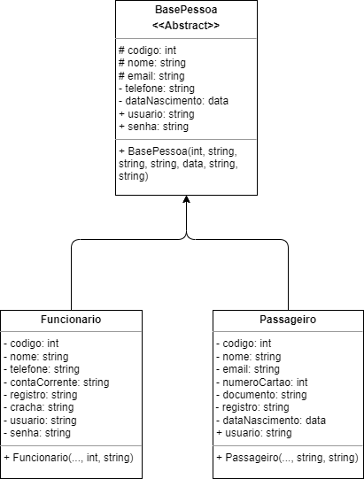
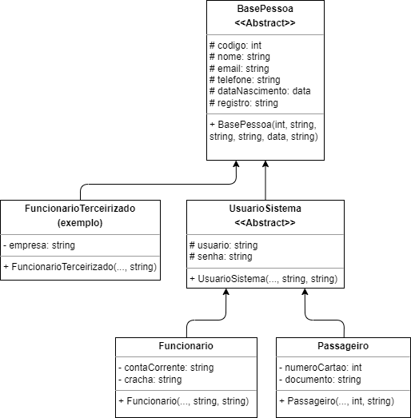

# Atividade 4

## Questão 01:
O estagiário começou um diagrama de classes, mas não finalizou, por algum 
motivo divino, sobrando para você terminar o trabalho dele. Mas parece que não está nada bom o que ele fez.  
Usando o que você aprendeu em POO, analise e otimize o diagrama abaixo, 
criando uma versão corrigida do diagrama, salvando o resultado em PDF.  
Após  isso,  crie  um  projeto  **Java**  chamado  ProjetoEstagiario,  codifique  as classes que você otimizou, publique no GitHub, e mande o link para o professor.

## Resposta:
Ao fazer uma simples análise do diagrama do nosso colega estagiário é possível perceber algumas falhas em diversos pontos, demonstrando pouca prática dos pilares fundamentais de POO (Abstração, Encapsulamento, Herança e Polimorfismo) e vou elencar algumas falhas que pude perceber:

 - **Abstração:**
   - Ao analisar os atributos é possível perceber alguns erros quanto ao tipo aplicado e a classe a quem deve ser atribuído:
     - **Tipo:** Não é aconselhável o uso de tipo `int` a atributos de registro como `numeroCartão` na classe `Passageiro`, por garantia da integridade do dado o idel é que se utilize o tipo de texto `String` para dados de registro como `cpf`, `rg`, `cracha`, etc.
     - **Classe:** Considerando a existência de uma classe abstrata chamada `BasePessoa` a qual dados comuns a pessoas devem ser atribuídos, não é muito justificável a atribuição de dados como `nome`, `telefone` e e`mail` as classes `Funcionario` e `Passageiro`, essa prática dificulta a organização do código.
 - **Encapsulamento:**
   - Tendo em vista que a classe `BasePessoa` é abstrata, os atributos `telefone` e `dataNascimento` são inacessíveis por estarem privados, uma vez que classes abstratas não podem ser instanciadas e seus herdeiros não conseguem acessar atributos privados.
   - Não é aconselhável por questões de segurança e organização do código que atributos ou métodos sejam desnecessáriamente públicos, livres ao acesso de qualquer objeto.  Portanto não é bom que os atributos `usuario` e `senha` sejam públicos, mas sim protegidos, para serem acessados por seus herdeiros e apenas por eles.
 - **Herança:**
   - Esse é o tópico mais claramente mal utilizado no diagrama. Herança serve para que atributos e métodos comuns a classes semelhantes (`Funcionario` e `Passageiro`) sejam implementados em uma classe pai (`BasePessoa`) a qual os filhos (`Funcionario` e `Passageiro`) herdem essas características e a possam alterar conforme necessário. Essa prática, quando corretamente aplicada, economiza linhas de código e permite mais clareza na visualização do mesmo.
     - Atributos como `codigo`, `nome`, `telefone`, `email`, `usuario`, `senha` e `dataNascimento` já estão "devidamente" implementados em `BasePessoa`, e `Funcionario` e `Passageiro` já as herdam, tornando desnecessária a implementação destes nas classes herdeiras.
     - O atributo `registro` é comum as duas classes herdeiras, pode portanto ser implementado na classe pai, facilitando a visualização do código.
 - Não houve a necessidade da aplicação de **Polimorfismo** no modelo de negócio.

### Sugestão de Alteração:
Considerando que uma classe chamada `BasePessoa` sirva para armazenar dados apenas sobre pessoas e não sobre usuários do sistema, sugiro a criação de uma clase intermediária UsuarioSistema a qual os atributos `usuario` e `senha` sejam implementados, permitindo a criação de novos objetos a partir da herança de `BasePessoa` sem a necessidade de criação de credenciais de acesso a um sistema.  
**Exemplo de Regra de Negócio:** **Funcionários Terceirizados** como equipe de limpeza, consultores, etc. e **Visitantes** não devem ter acesso ao sistema, mas devem ser registrados no mesmo.

----

## Modelo Corrigido:
### < Texto bonitinho que ainda vou fazer>

[Link para arquivo pdf](docs/uml_corrigido.drawio.pdf)