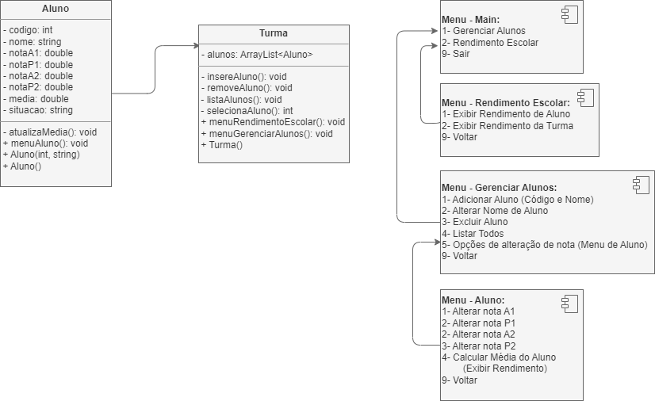

# Atividade 06

LOO - Atividade A2 - Atividade Enunciado
| Aluno | CPF| 
| :- | :-: |
| Carlos Eduardo Baraúna Recalde da Silva | 056.595.611-60 |
|  Diogo José Freitas de Oliveira | 040.733.651-69 |

## Questão
**Modalidade:** Programa desenvolvido em Linguagem Java  
**Tema:** Aplicando conceitos de POO e técnicas de programação.  

**Orientações:**  
Crie um programa em Linguagem Java, usando POO, que:
-  Implemente uma classe `Aluno`, contendo código(int), nome(string), nota A1(double), nota P1(double), nota A2(double), nota P2(double), média (double).
- Desenvolva uma função para exibir um menu com as opções:
    - Opção 1 – Gerenciar Alunos:
        - Opção 1 – Adicionar Aluno (informar apenas o código e o nome).
        - Opção 2 – Alterar nome do Aluno.
        - Opção 3 – Excluir Aluno.
        - Opção 4 – Listar todos.
        - Opção 5 – Selecionar um aluno da lista, para:
          - Opção 1 – Adicionar a nota A1 do aluno selecionado.
          - Opção 2 – Adicionar a nota P1 do aluno selecionado.
          - Opção 3 - Adicionar a nota A2 do aluno selecionado.
          - Opção 4 - Adicionar a nota P2 do aluno selecionado.
          - Opção 5 - Calcular a Média do Aluno (usando a fórmula abaixo), exibir o resultado, e se o aluno foi aprovado ou reprovado.
          - Média = ( ((P1 + A1)/2) + ((P2 + A2)/2) )/ 2.
    - Opção 2 – Rendimento Escolar:
      - Opção 1 – Selecionar um aluno da lista, para:
        - Exibir as notas de prova, de atividade e a média.
      - Opção 2 – Exibir rendimento da turma (a lista toda, exibir as notas de prova, de atividade e a média).
    - Opção 9 - Sair, finalizando o programa.
  - Modalidade: Trabalho em dupla.
  - Avaliação:
    - Apresentação do código, na data de entrega.
    - 01/11/2023
  - Pontuação:
    - Nota de Apresentação em dupla.
      - Até 2500 pontos de Atividade A2.
    - Nota de Apresentação Individual (questionamentos).
      - Até 1000 pontos na Prova N2.

---
## Desenvolvimento

Abstraindo o funcionamento do sistema proposto é possível determinar bem os atributos de uma Classe denominada `Aluno` e a assossiação e manipulação de múltiplos Objetos desta Classe, como uma `Turma` é composta por vários `Alunos`.

Ao analisar a estrutura do menu é possível abstrair os seguintes modos de interação com Objetos:
>- Interações com Aluno:
>     - Alterar nome ou nota.
>     - Calcular média.
>- Interações com Turma:
>     - Adicionar Aluno.
>     - Listar Alunos.
>     - Excluir Aluno.
>     - Selecionar Aluno.
>- Relatório por Aluno:
>     - Rendimento Escolar Individual.
>- Relatório por Turma:
>     - Rendimento Escolar Geral.

Ao fazer essa análise de interação entre os Objetos é possível perceber algumas atividades que envolvem um Objeto `Aluno` pré-determinado para alterar valores de seus atributos e outras que iteram a `Turma` como um todo para extrair algumas informações de todos.

---
Para facilitar a visualização do sistema proposto foi elaborado um Diagrama UML demonstrando a relação entre `Aluno` e `Turma` e os fluxos seguidos entre os diferentes menus:

## Projeto Java:

Para contemplar todas as expecificações do sistema proposto foi implementado o projeto `FakeDB-escola` contendo as Classes `Aluno` e `Turma` dentro do pacote `com.uniderp.projetoescola`. E no arquivo principal `App.java` contem a implementação do menu principal e a instância de um Objeto da Classe `Turma`.

### Classe `Aluno`:
Pertencente ao pacote `com.uniderp.projetoescola.models` é a Classe que define os métodos e atributos de Aluno em acordo com o Diagrama.  
<https://github.com/diogoJoseFreitas/UNIDERP-2023.2-LOO/blob/704c372207ac4f4f88d9de3b87061b5170a4b169/AULA-11/Atividade/Atividade%20-%2006/FakeDB-Escola/src/com/uniderp/projetoescola/models/Aluno.java#L1-L157>

Classe `Turma`:
Pertencente ao pacote `com.uniderp.projetoescola.FakeDB` é a Classe que define os métodos que iteram ou interagem com um *ArrayList* de Alunos.  
<https://github.com/diogoJoseFreitas/UNIDERP-2023.2-LOO/blob/704c372207ac4f4f88d9de3b87061b5170a4b169/AULA-11/Atividade/Atividade%20-%2006/FakeDB-Escola/src/com/uniderp/projetoescola/FakeDB/Turma.java#L1-L140>

Classe `App.java`:
Define a instância de uma Turma e interage com ela por meio de um menu definido menu principal.  
<https://github.com/diogoJoseFreitas/UNIDERP-2023.2-LOO/blob/704c372207ac4f4f88d9de3b87061b5170a4b169/AULA-11/Atividade/Atividade%20-%2006/FakeDB-Escola/src/App.java#L1-L38>